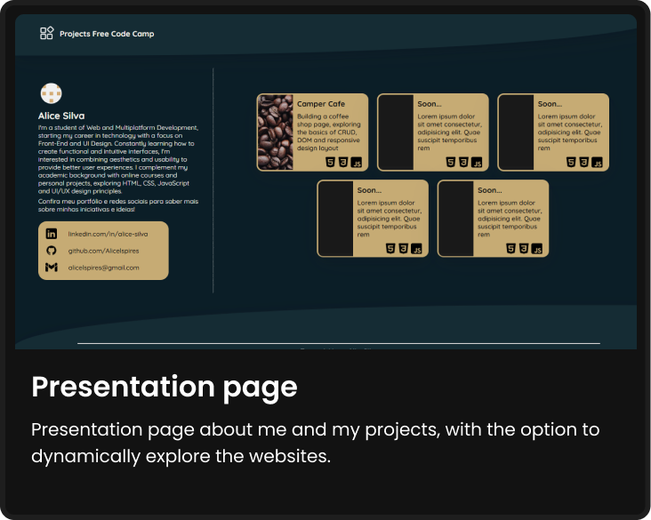
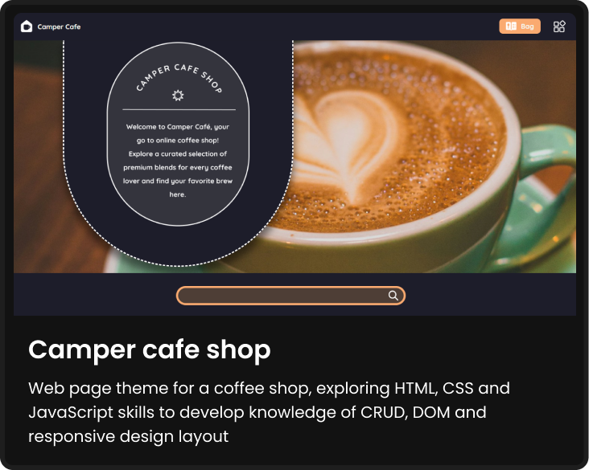
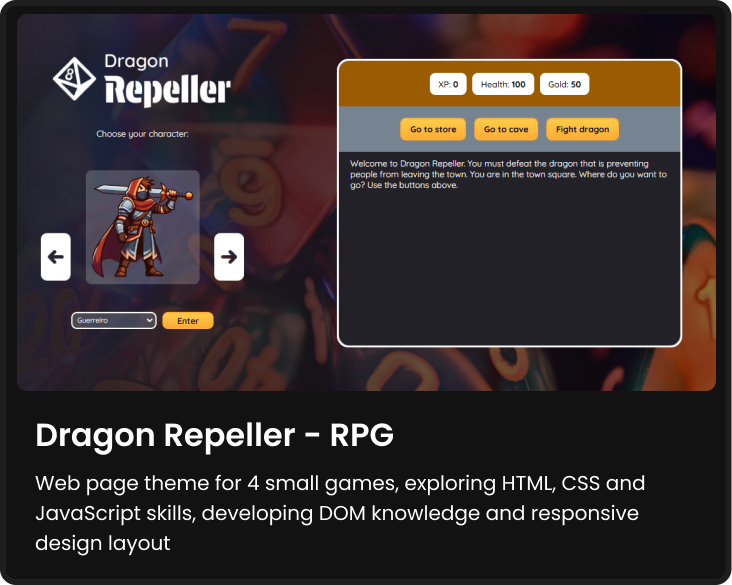

  

  # Projects with FreeCodeCamp
  

 
Interesting projects developed from FreeCodeCamp's “Responsive Web Design” and “JavaScript, Algorithms, and Data Structures” courses. This repository brings together creations and enhancements of ideas given in each module of the courses taken. Explore and enjoy! 

**Link** : https://alicelspires.github.io/Projects-with-Free-Code-Camp/

### Tools & Languages

Pages: Below are the preview cards for each project, click on one and you will be taken to the corresponding folder.

## Building in progress...🚧

  
  --
  

  
  --
  

