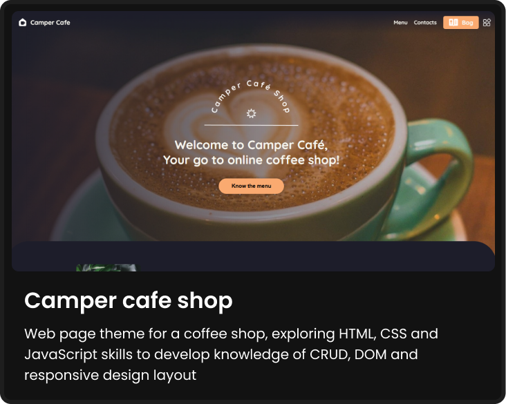
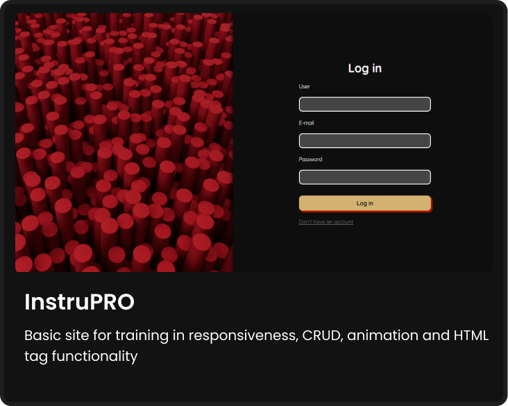
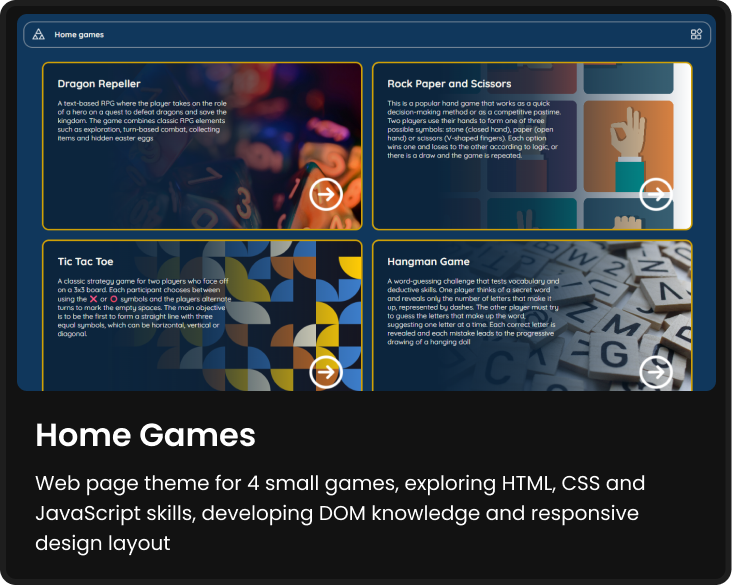
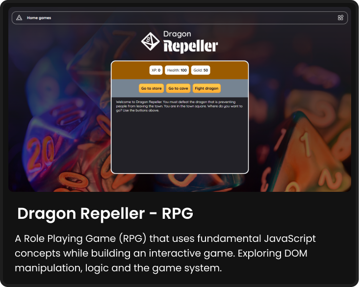
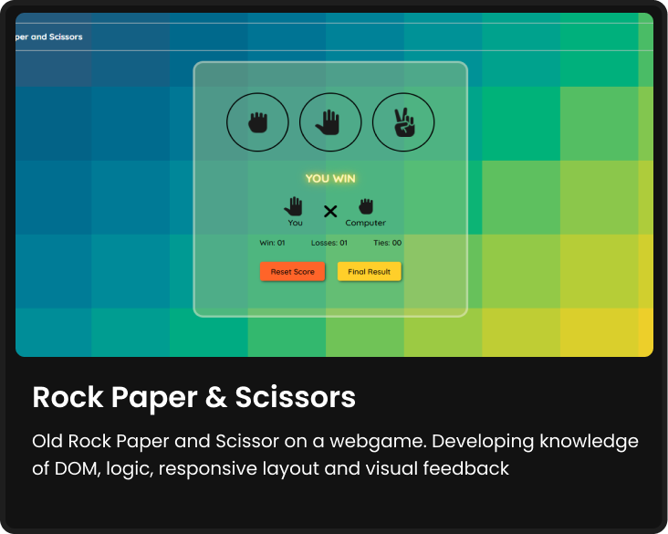
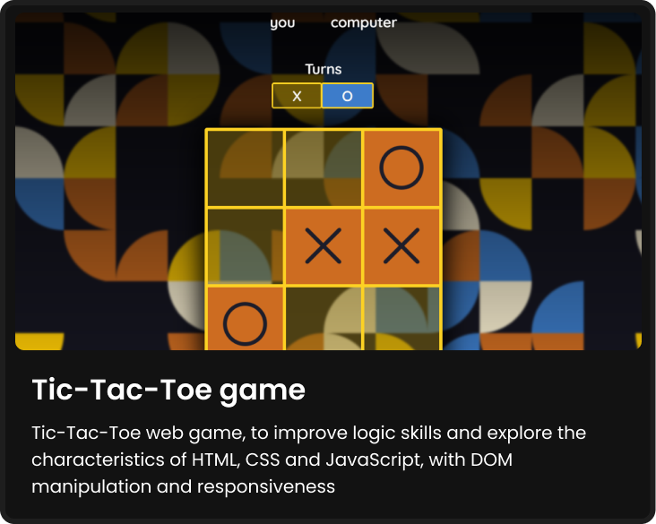
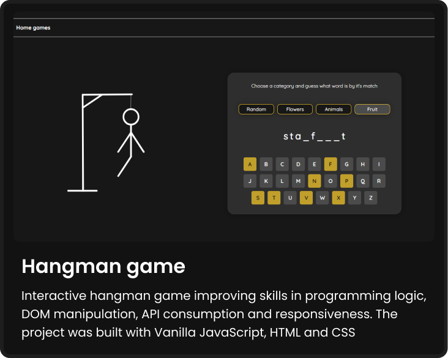
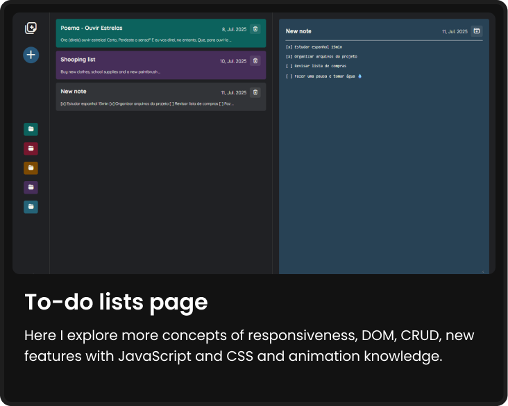

  

  # Learning Grounds – A Path of Projects
  

 
A collection of small web projects developed during <a href="https://www.freecodecamp.org/" >freeCodeCamp’s</a> “Responsive Web Design” and “JavaScript Algorithms and Data Structures” courses, with added inspiration from <a href="https://www.theodinproject.com/dashboard">The Odin Project</a>.
This portfolio brings together creative builds and refinements that showcase foundational web development skills, combining clean design principles with dynamic, interactive features. 

**Link** : [https://alicelspires.github.io/Projects-with-free-Code-Camp/](https://alicelspires.github.io/Projects-with-free-Code-Camp/)

### Tools & Languages

## Pages

 
Below are the preview cards for each project, click on one and you will be taken to the corresponding folder.

  
  --
  

  
  --
  

  
  --
  

  
  --
  

  

 
